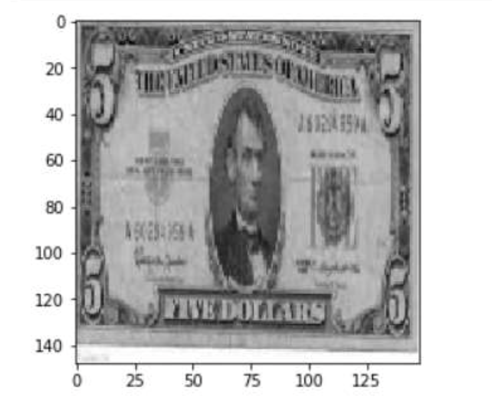
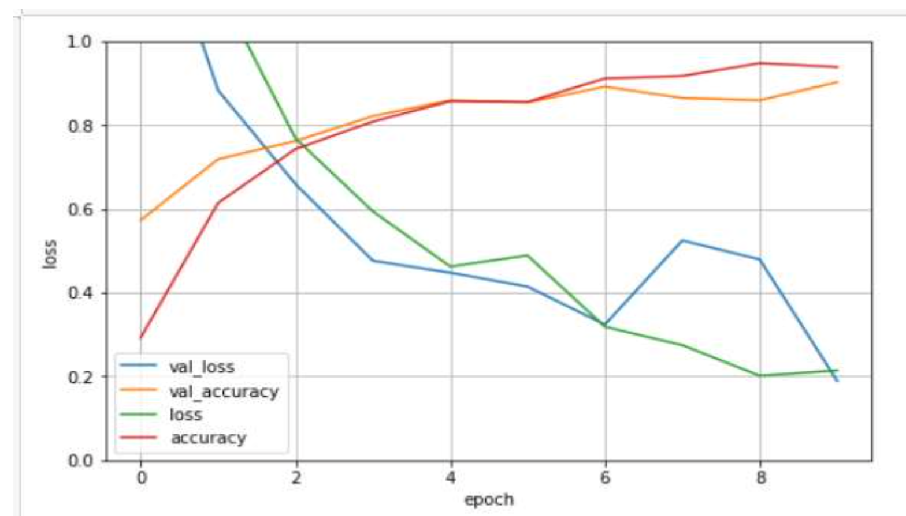
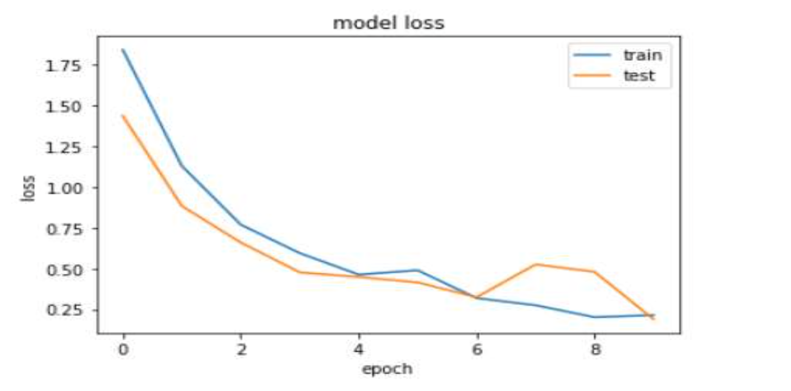

# Intelligent Currency Identification System
## Overview
Globally, there are around 180 currencies. Identification and tracking each currency manually is tough and not feasible for humans. Advent of Google lens has made it possible to scan and detect objects in one click. Blending Machine learning and Image processing can prove beneficial for development of efficient Cash Deposit Machines, Money transfer Machines around the globe. With this motivation we worked on data modelling system which classifies image into seven different categories i.e countries. This system can identify currencies like US dollar, Euro, Indian Rupees, Chinese Yuan and UAE Dirham. 

## Business Value/Analysis Aim
Currency identification systems primarily target Banking and Financial Sectors and Automated currency detection system when integrated with cash deposit machine can suffice deployment of autonomous banking systems. With this system Cash Deposit Machines can detect the currency based on the country and the denomination and hence it can handle currency transfer transaction in native currency in an automated fashion without any human intervention. Another possible use case is Money exchange systems. 

## Data Source and Description
To achieve the diversity, we thought of different ways of collecting the data for our project. Collection of data from different sources such as
- Downloading Google Images from internet,
- Manually taking pictures, taking pictures from many angles,
- Using plug-in to download multiple images,
- Having redundant images of currencies were part of the process.

## How did we pre process the data?
Divided our project into two categories.
1) Machine Learning model.
2) Deep learning model.

Applied following steps for data pre-processing.
#### 1) Machine Learning model.
- Imported each image and stored its pixel value in the arrays.
- Resized each image in the resolution of 148 X 148 in order to make all images
consistent.
- Converted all images to grayscale in order to reduce time during training and
increase consistency in the dataset.

#### 2) Deep learning Model
- Imported each image and stored its pixel value in the arrays.
- Resized each image in the resolution of 148 X 148 in order to make all images
consistent.
- Converted all images to grayscale in order to reduce time during training and increase consistency in the dataset.
- Augmented each image by rescaling it, flipping it horizontally and rotating it in range of 20. The main purpose of doing this is to add diversity to the dataset and to scale dataset in order to avoid over fitting in the model.

Above images the final preprocessed image.

## Model Evaluation and Results
**1) SGD Classifier:** The accuracy results of 3 fold cross validation which is applied on the model trained using SGD Classifier.
3 fold cross validation was used with an objective to address over fitting and to make our model more robust. The model had maximum accuracy of **81.62%**.

**2) Ensemble Learning Algorithm:** Evaluation results of all three models that is SGD Classifier, Random Forest Classifier and Ensemble Learning algorithm. In our case SGD Classifier worked best which had an accuracy of approximately **80.45%**

**3) CNN Deep Learning Model:** the results of the convolutional neural network which has been set to train the data for 10 epoch. Looking at the final epoch results we got accuracy on Training Data – **93.89%**, Accuracy on Validation Data - **90.27%**, and Accuracy on Test Data – **81.28%**.

#### Graphical Evaluation

The above figure plots training accuracy, validation accuracy, training loss and validation loss across each epoch. From the above figure it can be colcluded that training accuracy and validation accuracy increases through the epochs. There is not much difference between training accuracy and validation accuracy which shows that the model and not Overfitting.

The above figure plots training loss and validation loss across each epoch. From the above figure it can be colcluded that training loss and validation loss decreases through each epochs. There is not much difference between training loss and validation loss which shows that the model is training effectively.

